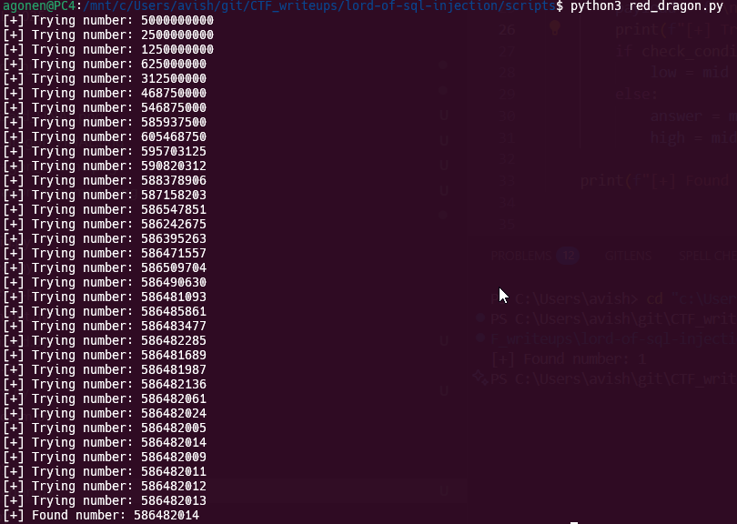

First, we see that we can inject whatever we want inside `id`, so let's give this (note to url encode this):
```
'||no>0#
```

However, as we can see this is 8 chars, and the limit is on 7 chars.

There, we can use this trick:
As we can see, it uses the `is_numeric` function. 
We can detect that this string:
```

1000
```


Okay, so by giving the `#` which comment one line, we can use the `>` on the number we supply in `no`, after the endline, so let's try this:
```
?id=%27||no>%23&no=%0a1
```


Now, let's use binary search to find the number:

```python

```



**Password:** ***`586482014`*** 
