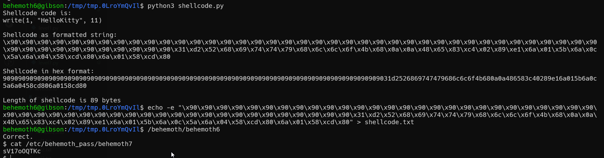

# behemoth level7 Solution

In this challenge, we need to write our own shellcode that will print "HelloKitty".
notice that you can't use '0xb' in the shellcode, which is the length of the string "HelloKitty", thus, i used '0xc' (it will stop after 11 characters because there is null there)

here the shellcode can be found
[level5.c](./scripts/level7.py)

**Flag:** ***`sV17oOQTKc`*** 
