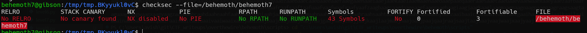
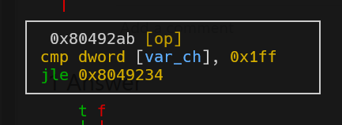
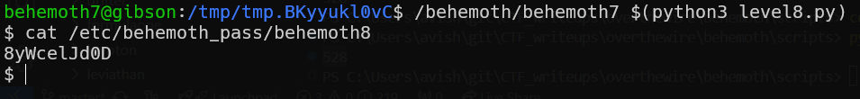

# behemoth level8 Solution

we can see it doesn't have ASLR and stack protection.

we've found using the begin of the script here [level8.py](./scripts/level8.py) that after 528 bytes we reach the ret-address. however, when trying to enter non alpha characters, it detects us and closing.

if we'll look closely, we can see that it checks only the 512 first characters, then, it will go to the strcpy without checking. YAY :)

now all left is to find the address of the buffer, play with the debugger to find it. notice it changes based on the length of the input you give it.

here can be found our injection: [level8.py](./scripts/level8.py)

**Flag:** ***`8yWcelJd0D`*** 
