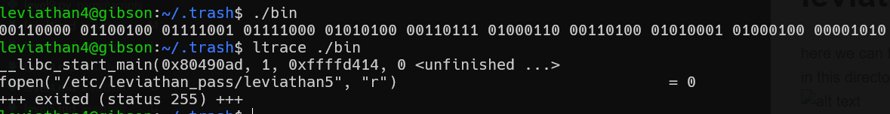
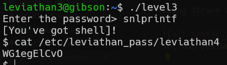

here we can find the hidden directory which called ".trash".
in this directory, we can run the "bin" file and use ltrace to see what it does

so, it prints the password in binary,

using online tools we can find the password

**Flag:** ***`0dyxT7F4QD`*** 
