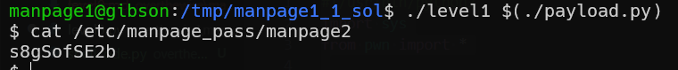

here is almost as before, but we defuse the SIGTERM by setting our signal handler, in this case, a simple SIG_IGN.
```c

```
```python

```


don't forget to put the shellcode in an environment variable, and put the address of the shellcode in `shellcode_address`, in the payload.py file.



**Flag:** ***`s8gSofSE2b`*** 
