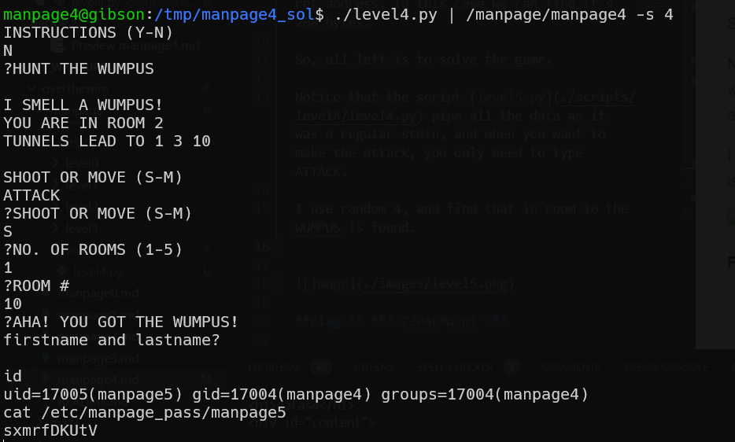

In this challenge we exploit the fact we can put input into `inp` on the stack, which is 2048, and then there will be content on `lastname`.
When we will manage to win the game, we can insert new-line into the first name, and then lastname will contain garbage values, and there will be no problem when it'll copy it to `buf`.

However, the stack isn't empty... because, we filled it before with our content.

This is the address of `inp`: 0xffffcb34 and this is of `lastname`: 0xffffd038.
The diff between them is 1284, and then we need to find how many characters we need to put in `lastname` until it override the ret-address, in this case we can find it's 208 bytes.

So, all left is to solve the game.

```py

```
 pipe all the data as it was a regular stdin, and when you want to make the attack, you only need to type ATTACK.

I use random 4, and find that in room 10 the WUMPUS is found.

* execute 
```
./level4.py | /manpage/manpage4 -s 4
```
* input `N` new line, `ATTACK` new line, `S` new line, `1` new line, `10` new line, `\n`.




**Flag:** ***`sxmrfDKUtV`*** 
