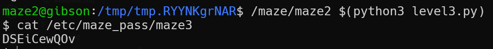

# maze level2 Solution

in this challange, we inject short code that pushes the shellcode address, and then executes the shellcode.

the code is here [level2.py](./scripts/level2/level2.py)

**Flag:** ***`DSEiCewQOv`*** 
