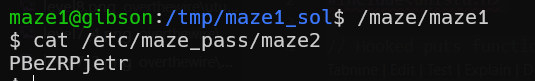

# maze level1 Solution

in this challange, we need to create our own `libc.so.4` that will be used by the program.

```c
% scripts/hook.c
```
, you need to adjust the addresses on the stack of the (maybe) local variables.

the commands for compiling and linking the so file, here.
```
gcc -m32 -shared -fPIC -o libc.so.4 hook.c -ldl
```

notice the tmp dir you're working on can't be something that `mktemp` has made, it won't work properly.



**Flag:** ***`PBeZRPjetr`*** 
