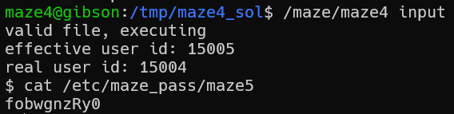

in this challenge we override one address, and put there value that will fit our needs.
also, we need to give short script in bash that will open shell, i do it using the following commands:

```c

```
, we will use this file as shebang. 

* then, we need to put the payload into our file, lets say it's input `python3 level5.py > input` and of course, change to executable `chmod +x input`. 

the whole process:
```
cat > code.c
gcc -m32 code.c -o code
```

```
python3 level4.py > input
chmod +x input
```



**Flag:** ***`fobwgnzRy0`*** 
