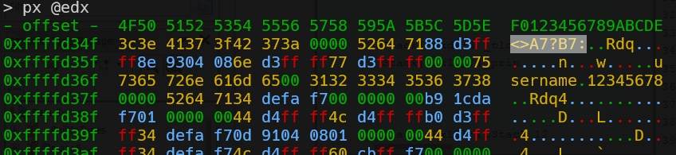
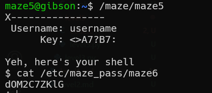

simple reverse engineering can show us that for the username: `username`, the password should be `<>A7?B7:`

so, give these credentials:
username: `username`
password: `<>A7?B7:`

**Flag:** ***`dOM2C7ZKlG`*** 
