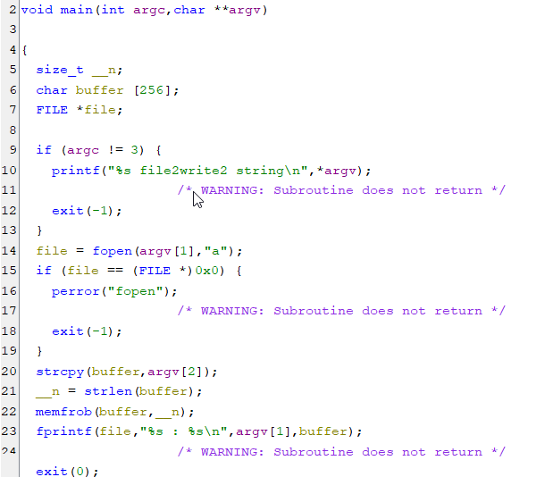

i decompiled maze 6, here you can see the source code.



in this challenge we use buffer overflow to override the file.
we make our own File* struct, and put there in the write buffer our address, the address of the exit function in plt, and then we'll write there the shellcode.

* this is a regular FILE* struct, when we open `file` for writing.
* the words i marked are: *_IO_write_base*, *_IO_write_ptr*, *_IO_write_end*


* we need to find the address of exit in the plt record


so, the address of exit function in plt is `0x0804b208`

* we need to inject our shellcode and find its address, we need to find the address of our malware FILE* struct.

we can see that the address of shellcode is `0xffffd204` and address of our malware FILE* struct `0xffffd158`

for summary, we need to find this values:
```
FILE_struct_address  = 0xffffd158
plt_exit_address = 0x0804b208
shellcode_address = 0xffffd204
```
the code can be found here [level7.py]
```python

```


**Flag:** ***`B6XkM3Syq6`*** 
