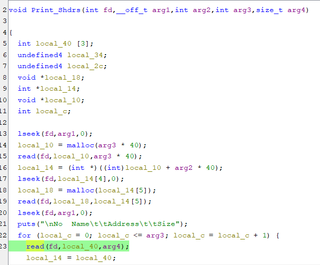
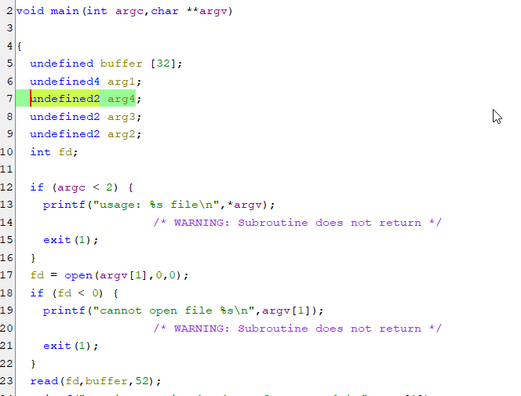
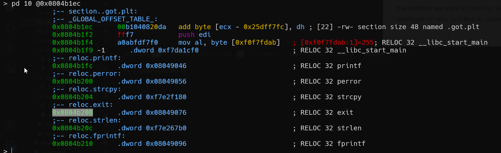
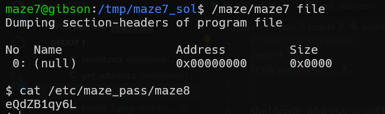

we will exploit the line marked, and override the ret-address by giving value of 0x44 in the size, while the ret-address is at 0x40.


in the payload all the staff is \x00, with one exception, when we pass arg4 which contains the size.
we do it using buffer overflow 


i marked important values: arg1, arg2, arg3, arg4, fd. (in this order), so we can see that *arg4* is found after *46 bytes*.


 
now, all left is to create your shellcode in environment variable and put the address in the code, in `shellcode_address`.
```python

```




**Flag:** ***`eQdZB1qy6L`*** 
