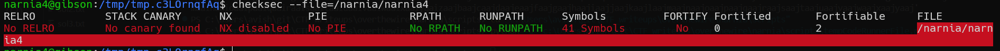
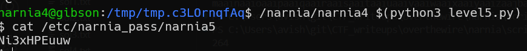

# narnia level5 Solution

we can see it doesn't have ASLR and stack protection.

we've found using the begin of the script here [level5.py](./scripts/level5.py) that after 264 bytes we reach the ret-address. 

now all left is to find the address of the buffer, play with the debugger to find it. notice it changes based on the length of the input you give it.

here can be found our injection: [level5.py](./scripts/level5.py)

**Flag:** ***`Ni3xHPEuuw`*** 
