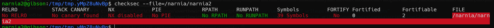
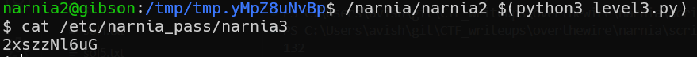

first we can see it doesn't have ASLR and run protection.

we will use our shellcode [shellcode.py](./general/shellcode.py) and store it in environment variable, then we will find the address of the environment variable using [get_address.c](./general/get_address.c)

using the script we saw we override the return address after 132, so let's insert the address of our environment variable. 

**Flag:** ***`2xszzNl6uG`*** 
