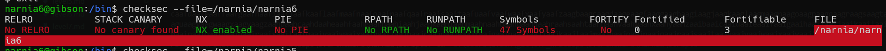
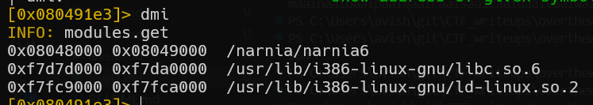
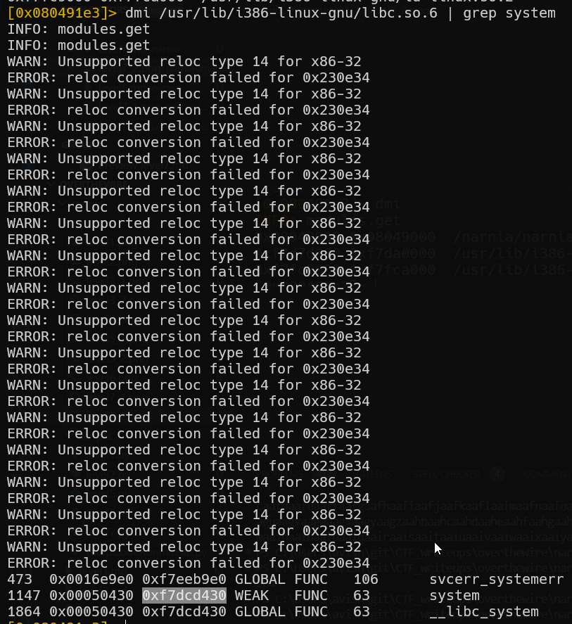

# narnia level7 Solution

we can see it doesn't have ASLR but have stack protection.

in this level, we will call the system func with the command:`/bin/sh`, then it will execute this: `system("/bin/sh")`

first we need to find the address of system function, it being included during runtime via the `libc.so.6`. the range of the addresses there is at `0xf7......`, and that's what we need.

i use radare2, first i analyze it, start running it, and let it run until main. it is important to let it run, because otherwise it won't load our desired shared library.
`aaa; ood; dcu main`

then, check the name of the loaded binaries, and finally search for symbols in our load library, and greping for system.

so, the (virtual)address of system on the RAM is `0xf7dcd430`, let's put it into the script, 

 [level7.py](./scripts/level7.py)

**Flag:** ***`54RtepCEU0`*** 
