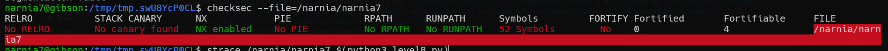
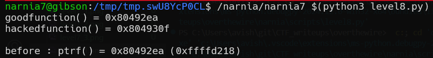
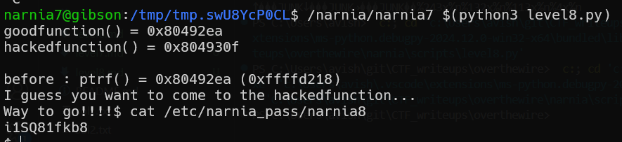

# narnia level8 Solution

we can see it doesn't have ASLR but have stack protection.

the address we want to insert is the address of the hacked function: `0x804930f`
the address we will override is the address of the ptr: `0xffffd218`
they can be found here: 

the python script for creating the payload can is here: [level8.py](./scripts/level8.py)

**Flag:** ***`i1SQ81fkb8`*** 
