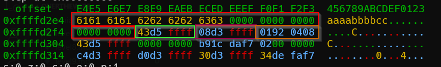
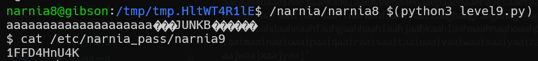

# narnia level9 Solution

we can see it doesn't have ASLR and no stack protection.


we will generate shellcode using the [shellcode.py](./general/shellcode.py) script

now we will load the shellcode into env variable:
`export SHELLCODE=$(python3 shellcode.py)`
we need to find the address of the env variable, using the [get_address.c](./general/get_address.c). notice to compile it with the `-m32` flag, for example: `gcc -m32 get_address.c -o get_address`

we'll try to override the address of printf and put there our address of shellcode.

as you can see, there is the buffer of bluh which is 20 bytes. then, the address of the buffer bok, then the of ebp, and then the ret-address.

after finding the address of the env variable, in our case: `0xffffd511`, we need to insert it to the script that solves the challenge [level9.py]
```python
% scripts/level9.py
```


we need to play a bit with the script to find the right addres of bok, it might be a little different than the address in the debugger.




**Flag:** ***`1FFD4HnU4K`*** 
