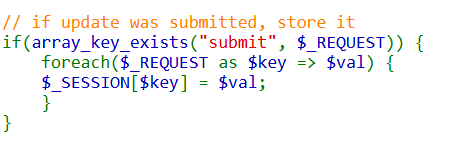
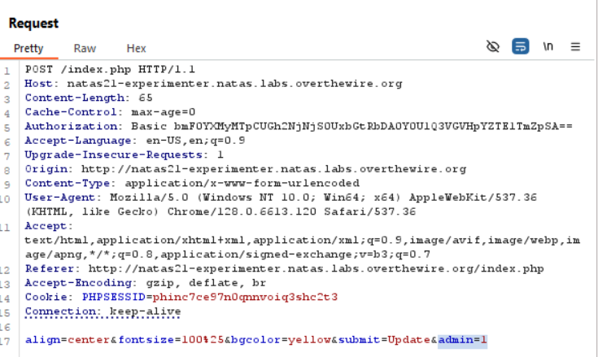

i can give it in the HTTP post every pare of key,value i want.

i used burp suite:

then, return to the original website. remember to use the same PHPSESS cookie.

**Flag:** ***`d8rwGBl0Xslg3b76uh3fEbSlnOUBlozz`*** 