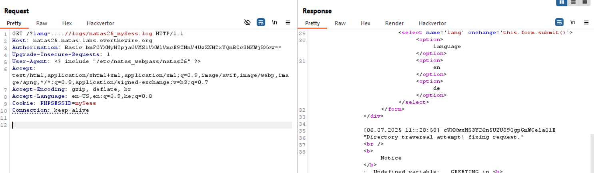

Here, we bypass the `Path traversal` detection
```php
if(strstr($filename,"../")){
            logRequest("Directory traversal attempt! fixing request.");
            $filename=str_replace("../","",$filename);
}
```
by simply providing something like this, `....//logs/mylog.log`, and then it removes only the first instance.

Then, we can see it appends our `User-Agent` to the log file that is accessible for us, so let's put in the `User-Agent` the value: `<? include "/etc/natas_webpass/natas26" ?>`



**Flag:** ***`cVXXwxMS3Y26n5UZU89QgpGmWCelaQlE`*** 