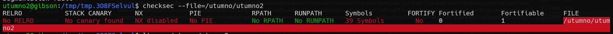
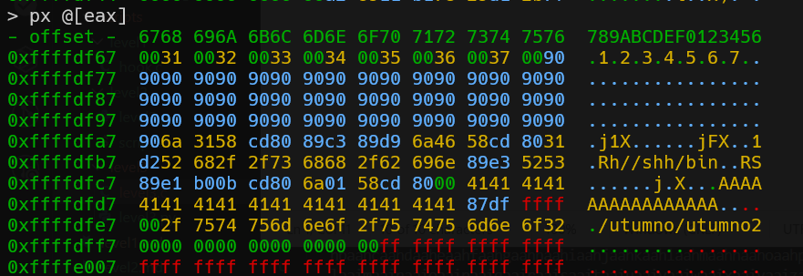
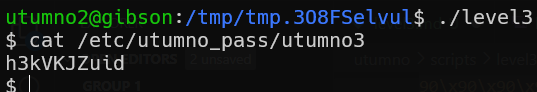

# utumno level2 Solution

first we can see there is no protection, and also ASLR disabled.

then, after analyzing the code i realized that i can pass at the 9th place of envp some content that will be written to a buffer, and also i found out that the ret address is found in the stack after 16 bytes. 
so, what we need to do is override the ret address and put our shellcode.

because we run with envp, it overrides our regular SHELLCODE environment variable.

we need to find the address of the shellcode, try debugging and find it. for example: 

(here i debug and put breakpoint on where the main of /utumno/utumno2 is find, it won't change because ASLR is turned off)

here is the code [level2.c](./scripts/level2/level2.c), only change the address_of_shellcode variable and this should work. 

**Flag:** ***`h3kVKJZuid`*** 
