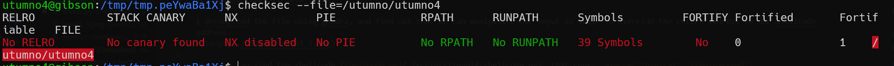
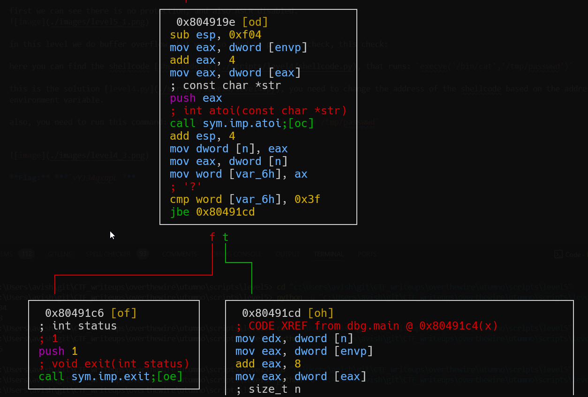
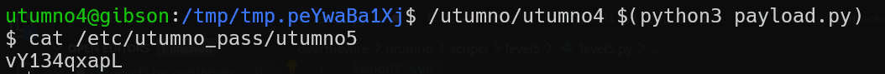

# utumno level4 Solution

first we can see there is no protection, and also ASLR disabled.

i decompiled the file using ghidra, and find out that we can manipulate our input in order to override the return address to our shellcode address. 

here you can find the shellcode [shellcode.py](./scripts/level4/shellcode.py), that runs: `execve('/bin/cat','/tmp/passwwd')`

this is the solution [level4.py](./scripts/level4/level4.py), you need to change the address of the shellcode based on the address of your environment variable.

also, you need to run this command: `ln -sf /etc/utumno_pass/utumno4 /tmp/passwwd`

**Flag:** ***`qHWLExh7C5`*** 
