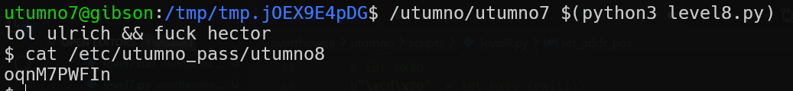

# utumno level7 Solution

here we override the ebp stored register, and put there our address. in the code it called `buffer_address`, you need to put there the address of the buffer.
also, there is address for the shellcode, which stored in `shellcode_address`.
the solution is here [level7.py](./scripts/level7/level7.py), you need to fill these two fields with correct addresses.

**Flag:** ***`oqnM7PWFIn`*** 
