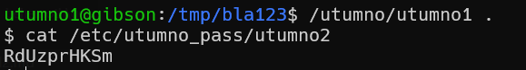

here, we need to put our shellcode after "sh_". there is a small problem that we can't use "\\" in the shell code, because this char can't be in filname

```python

```

```sh

```


In the shellcode it tries to execute this command: `system("sh")`, so it means we need to link it to `/bin/sh`.

put the code in the files `cat > script.sh` and `cat > shellcode.py`

these are the commands that you need to run.
```
chmod +x script.sh
ln -sf /bin/sh sh
./script.sh
```
lastly, run this: `/utumno/utumno1 .`



**Flag:** ***`RdUzprHKSm`*** 
