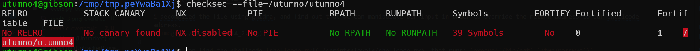
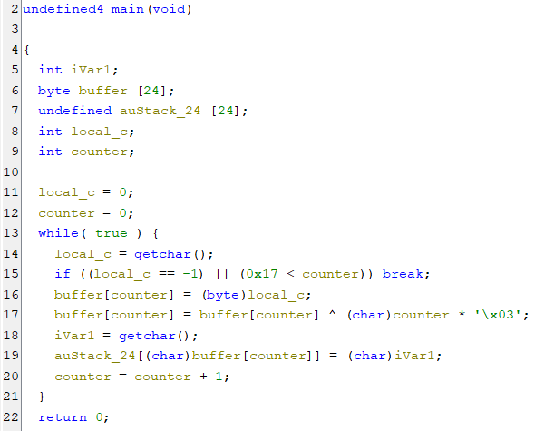
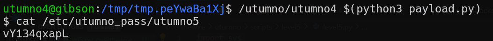

first we can see there is no protection, and also ASLR disabled.


in this level we do buffer overflow, but we also need to pass one check, this check:

check that the len of the buffer answer on specific rule.

here you can find the shellcode [shellcode.py](./general/shellcode.py)

```py

```
, you need to change the address of the shellcode based on the address of your environment variable.



**Flag:** ***`vY134qxapL`*** 
