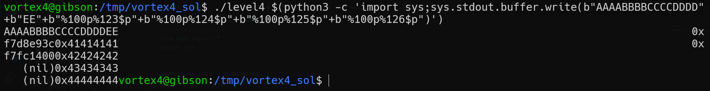
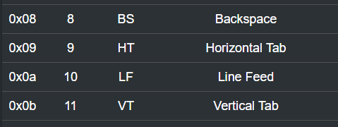
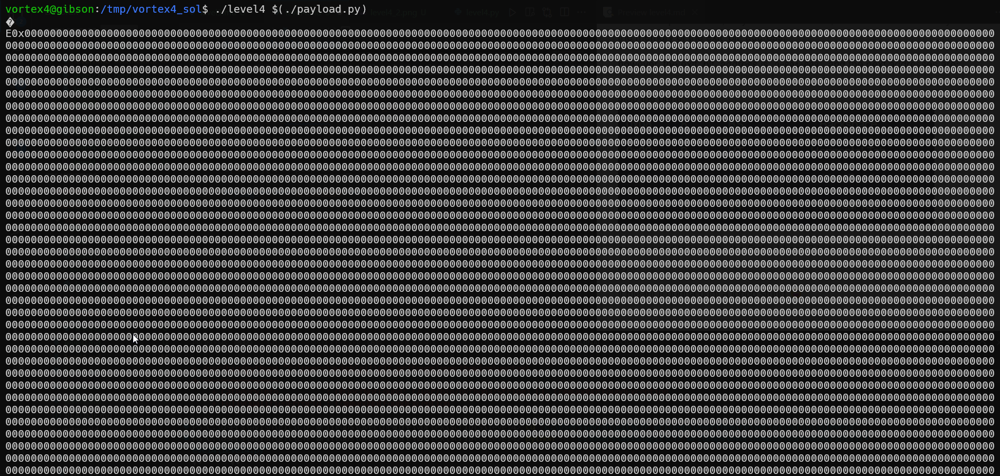
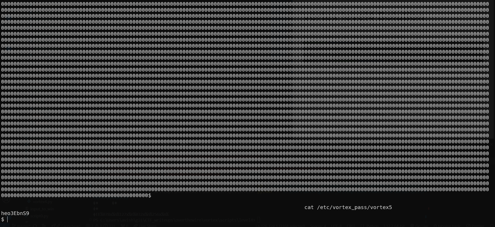

# vortex level4 Solution

in this challenge we had format string attack. 

here we need to play more with the stack, in order to find where our stored memories are, we need to use `$` inside format strings, to navigate through the stack. 

i wrote simple solution, as you can see above, that write each time a byte to the memory of the exit_plt_address.

however, the exit_plt_address is `0x804c008`, and the next addresses are: `0x804c009`, `0x804c00a`, `0x804c00b`, which all contains characters that will stop the printf 

so, we need to insert to the first address 3 bytes, and to the forth address 1 byte.

it meant it gonna print a longg string :)

i wrote this c code that will run `/vortex/vortex4` with the payload [level4.c](./scripts/level4/level4.c)

the script is here [level4.py](./scripts/level4/level4.py), you need to adjust the `address_of_exit` and the `address_of_shellcode`, debug and find it. 

this is our code [level3.py](./scripts/level3/level3.py)

**Flag:** ***`heo3EbnS9`*** 
