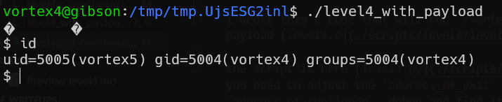

# vortex level4 Solution
In this challenge, we had a format string attack.

Here, we needed to manipulate the stack to find where our stored memory is. We used `$` inside format strings to navigate through the stack.

I wrote a simple solution, as shown above, that writes each byte to the memory of the `exit_plt_address`.

The `exit_plt_address` is `0x804c008`, and the next addresses are: `0x804c009`, `0x804c00a`, `0x804c00b`, which all contain characters, causing the print to stop when using Python.

So, we needed to insert 3 bytes into the first address and 1 byte into the fourth address. This results in a long string being printed.

I wrote this C code to run `/vortex/vortex4` with the payload (`level4.c`).

The script is located here: [level4.py](./scripts/level4/level4.py). You need to adjust the `address_of_exit` and `address_of_shellcode`, debug, and find them.

**Flag:** ***`heo3EbnS9`***

**Note:** I now noticed that the issue is with the script. You can use [level4_with_payload.c](./scripts/level4/level4_with_payload.c) and just provide the payload inside, the regular payload will work.

