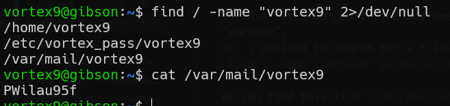

in this level we can't find any exec file which named "vortex9".
so, i decided to search for a files with the name "vortex9"
`find / -name "vortex9" 2>/dev/null`.

we can find this file `/var/mail/vortex9`
which contains the password. YAY :)

**Flag:** ***`PWilau95f`***