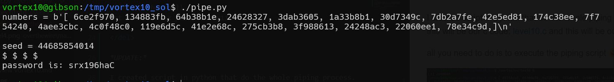

in this level we need to exploit the fact the seed isn't really randomized, and we can find it.

<del>
the difficulty with this level is the way we solve it, when we need to be fast when input the seed back to /vortex/vortex10.

this is the process:

run vortex in the background `/vortex/vortex10 &`, copy the 20 numbers and give it to level10 solution 
```
./code "[ 406d24bc, 611ce048, 730ce6d4, 6d26333f, 4c62274d, 6351d72e, 0f9cbb1f, 0beed3e0, 484b284e, 1afcb11c, 72b9599f, 4c65ffd3, 0051df7c, 492c9c2d, 0004bba9, 5855a95d, 2d85388d, 021bb254, 65d633cb, 559b6674,]"
```
then, we need to hope we get printable result, return our vortex10 to foreground using `fg` and give it our seed. If we'll be lucky, we'll manage to get our shell and might have enough time to read the password, before it disconnect. YAY :(

```
/vortex/vortex10 &
./level10 ""
fg

# inside the shell
cat /etc/vortex_pass/vortex11 
```
</del>

*UPDATE:*

I created script in python that do the whole piping process.
```c

```
```py

```
.

all you need to do is to execute the piping script :)



**Flag:** ***`srx196haC`***