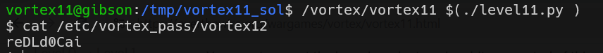

# vortex level11 Solution

I've found that on the heap there is an address that it + 0x40 will be the address of `s`, so, we need to put there our exit plt and override it using shellcode address.

only modify the `plt_exit_address` and the `shellcode_address` variables, in this script [level11.py](./scripts/level11/level11.py)

**Flag:** ***`reDLd0Cai`***