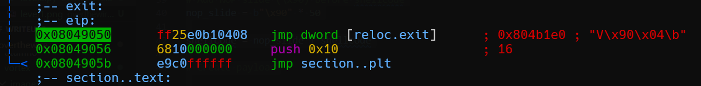
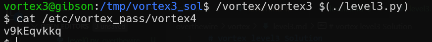

# vortex level3 Solution

another buffer overflow challenge.

here we will take the address `0x08049052`, and this will be lpp. it points to `0x0804b1e0`, which points to the exit func, our buffer will put the shell code there.

this is our code [level3.py](./scripts/level3/level3.py)

**Flag:** ***`v9kEqvkkq`*** 
