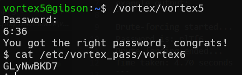

# vortex level5 Solution

in this challenge we run brute force on md5, which approved to be vulnerable to collision attack.

we can use this script [level5.py](./scripts/level5/level5.py), which will do the brute force for us.

example output:
```
Brute-forcing started...
Password is: rlTf6
Brute-forcing ended...
Time taken: 4.70 seconds
```
so, the password is: `rlTf6`



**Flag:** ***`heo3EbnS9`***