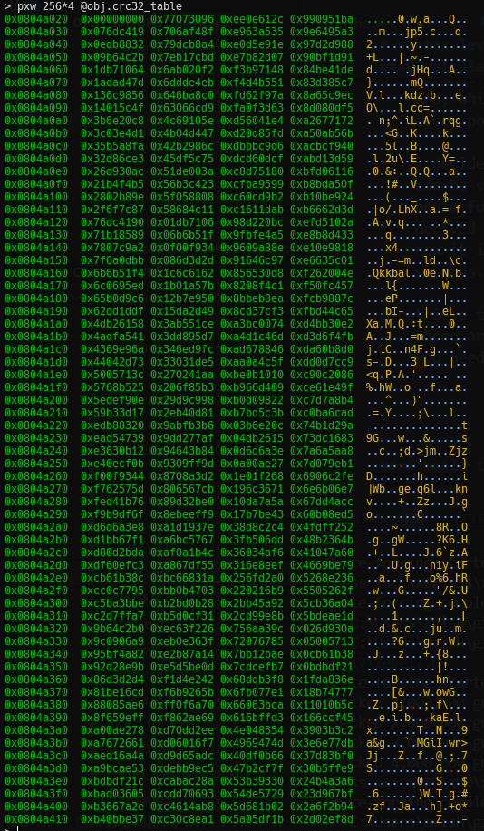
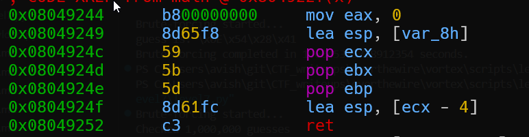
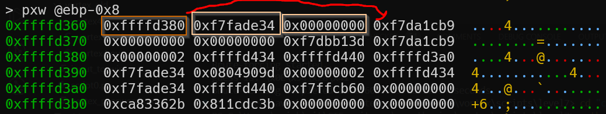
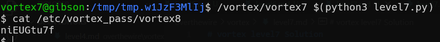

# vortex level7 Solution

in this level we need to exploit buffer overflow. also, the CRC32 of the buffer needs to be `0xe1ca95ee`

#### calculate the CRC
* brute force
    we modify the CRC32 of the buffer by adding 4 bytes at the end, which gives us the ability to change the CRC32 to every possible value.
  
    i decided to go on brute force, however, calculating 2^32 can be very expensive, so i added some optimization by brute forcing only 3 bytes, and the last byte can be derived directly.
    now it is possible to calculate the CRC, it takes about 10 seconds.

* retrieve the CRC tables
    there are saved CRC tables which are stored in the memory, you need to achieve them and put them in the code.
    this is the command i used in radare2 `pxw 256*4 @obj.crc32_table`.

#### build the payload
* as we can see, we can't just override the return address, we need to put in the esp something the will point to somewhere, this will be stored in ecx.
than, it will go 4 back and inside this memory, it'll find the shellcode address.

we'll put in ecx the address forward, and then in ebx and ebp the shellcode address.

also, you need to find the shellcode address, i put the shellcode in the buffer after @ebp+0x4, just debug and you'll find.

so, this is the code [level7.py](./scripts/level7/level7.py), all you need to change is `shellcode_address` and `ecx_address`.

**Flag:** ***`niEUGtu7f`***