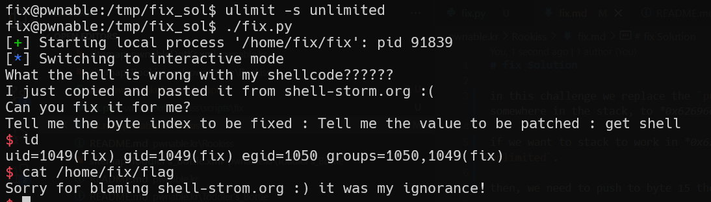

# brain_fuck Solution

in this challenge we give payload that override the plt table in 3 different places, in memset -> gets
in fgets -> system
and in putchar -> main.

then, we send "/bin/sh" that will pushed into the stack in the second run if main, in gets, and when "fgets" will be called, system("/bin/sh") will get executed. 

```py
% scripts/brain_fuck.py
```




**Flag:** ***`BrainFuck? what a weird language..`***
