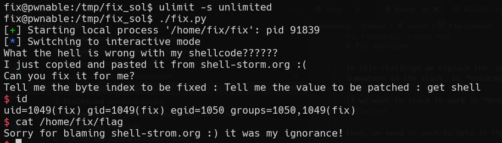

# fix Solution

in this challenge we replace the `push eax` with `pop esp`, and by this way we push the value of ebx to somewhere in the stack, to *0x62696e2f*, which is equivalent to the string *bin\\*.

if we want to stack to work in *0x62696e2f* we need to enable it, by executing this line: `ulimit -s unlimited`.

then, we need to push to byte 15 the value 92, which is 0x5c, which is `pop esp`.

this is our script [fix.py](./scripts/fix/fix.py)

**Flag:** ***`Sorry for blaming shell-strom.org :) it was my ignorance!`***
