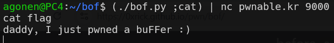

# bof Solution

this is simple buffer overflow, notice it takes us 52 bytes till we reach the arguments pass to the function, which is where 0xdeadbeef is stored.
```py

```
 and run this line `(./bof.py ;cat) | nc pwnable.kr 9000`



**Flag:** ***`daddy, I just pwned a buFFer :)`***
