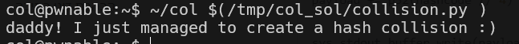

# collision Solution

in this challenge we need to give input that answer the criteria that is expected. we can use this script [collision.py](./scripts/collision/collision.py)

**Flag:** ***`daddy! I just managed to create a hash collision :)`***
