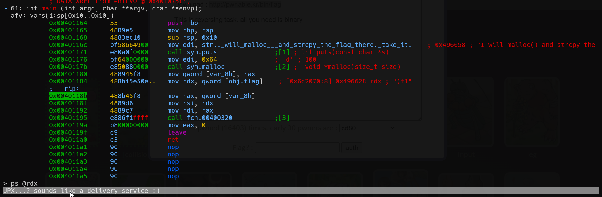

# flag Solution

first i used strings on the file, and found it compressed with UPX32.
then, i decompressed it using upx, `upx -d flag`.
lastly, i debugged the program using radare2 and viewed the flag.

**Flag:** ***`UPX...? sounds like a delivery service :)`***
