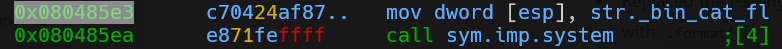
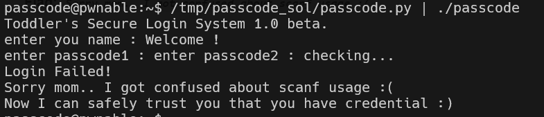

# passcode Solution

in this level we exploit the fact we can fill the stack with our data, then we can change the address of `passcode1`.
so, we choose what will be the memory in this place, and also what will be the content.

in this case, i chose the put the memory of the `exit_plt`, and override it with the memory where we print the flag 

you can use this script [passcode.py](./scripts/passcode/passcode.py) you might need to adjust the addresses.

**Flag:** ***`Sorry mom.. I got confused about scanf usage :(`***
