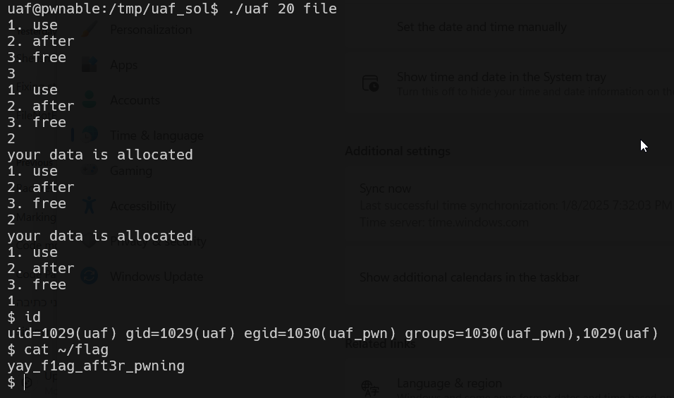

# uaf Solution

here we exploit the fact we delete Man and Woman, and manage to put our code inside the grave of Man and Woman.
Then, when we'll call it's introduce function, it will execute shell.

```py
% scripts/payload.py
```


we will give as input this values:
```
3 (for free)
2 (for put our payload once)
2 (for put our payload twice)
1 (for calling "introduce")
```



**Flag:** ***`yay_f1ag_aft3r_pwning`***
