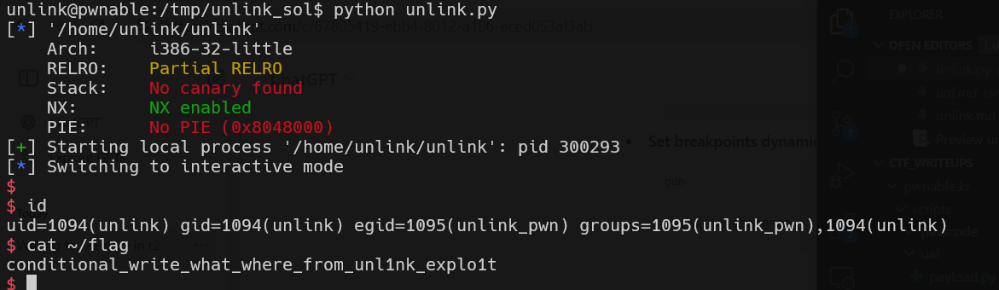

# unlink Solution

in this challenge we used the way it return from the main, and build the payload.

we inject in the stack, where ecx will get the address from. then, we make sure that we put the shell function address in [ecx-4].

```py

```




**Flag:** ***`conditional_write_what_where_from_unl1nk_explo1t`***
