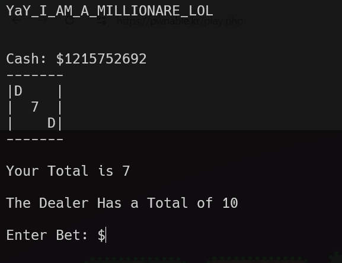

in this challenge, it checks if the bet is bigger than the cash. however, i can give it negative number, it will pass the check, and when i'll loose it will do so: cash = cash - bet, which give me a lot of money.

for example, i gave `-100000000000`

**Flag:** ***`YaY_I_AM_A_MILLIONARE_LOL`***
