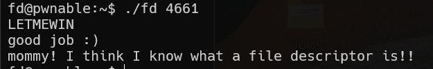

in this challenge the file-descriptor will be our input minus 0x1234.
so, let's give it 0x1234+1 = 4661, and this will make the file-descriptor to be 1, which is stdin.
Then, we will give the desired input `LETMEWIN` and that's it.

**Flag:** ***`mommy! I think I know what a file descriptor is!!`***
