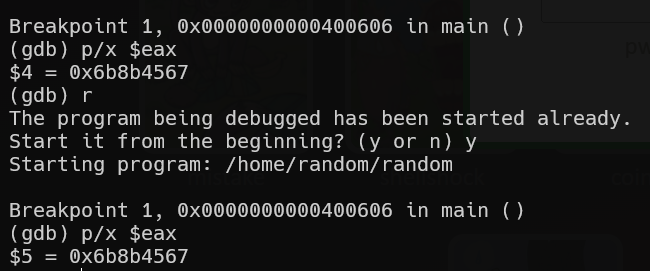

# random Solution

here is using rand(), without setting the seed using srand().
so, it means it uses the default seed and this will always give the same sequence.
as you can see, it always give the same value, `0x6b8b4567`

now, we need to give in int this value: 0xdeadbeef ^ 0x6b8b4567, which gives us `3039230856`

**Flag:** ***`Mommy, I thought libc random is unpredictable...`***
